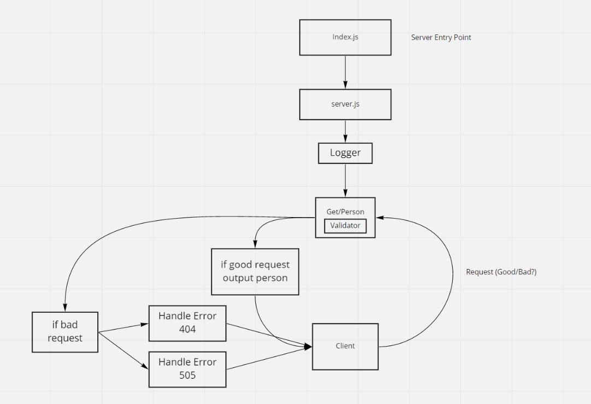

# Basic Express Server

Created by Anthony Morton

## Installation
Express, jest, dotenv, supertest, nodemon

## Summary of Problem Domain
Testing /person route

## Links to application deployment
talk: https://anthonymort-server-deploy-prod.herokuapp.com/person
pull request: https://github.com/anthonylouismorton/server-deployment-practice/pull/1
actions: https://github.com/anthonylouismorton/server-deployment-practice/actions

## Include embedded UML

## Talk about your routes

## Routes

* HTTP GET
  * Path: /Person
    * responds with name object `/person`.

